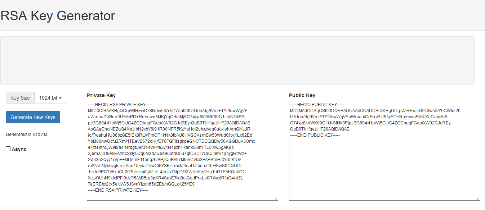
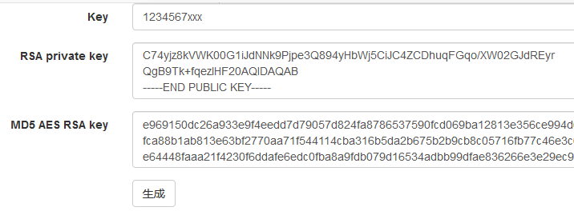

## 介绍

这是一个基于Github Pages的轻量级博客模板，也是一个安全、高隐私级别的博客模板！可自定义，可本地浏览（不需要任何环境，只需要浏览器），以及数据迁移方便，这点用过Hexo的估计都踩过坑！博客留言、私密留言、私密日记都基于Issues。

## 目前支持

+ 博客Markdown展示
+ 留言板系统（Markdown支持）
+ 私密留言功能（RSA加密）
+ 私密日记功能（RSA加密）

## 初始化自己的项目

### 1. Fork这个项目到你的Github上

### 2. pull到你本地
`git clone xxx`

### 3. 初始化配置

+ CNAME
该文件中的内容指向你的网站域名，若没有，请删除之！

+ config/article.js

```js
rightCount = 10 // 右侧边栏显示条数，查找不受此限制
markdir = "mds/" // markdown文件存放地址
marks = [ // 仓库中的文件列表
	{
		"name": "项目介绍",
		"tags":["second","demo"]
	}
]

```

+ config/core.js

```js
/**
	需要实现留言的在此设置
*/

// 用于装issues的仓库名
repo = "pysrc/ispring"

// 首页标题
indexTitle = "Coding I'm serious"

// 首页头标题
indexHeader = "Welcome To Ispring"

// 用于匿名评论的github用户名
user = "land123"

// 用于匿名评论的github密码
pwd = "379679586@qq.com"

// 用于留言板的issues number
msgNumber = 2

// 用于存放加密留言信息的issue number
primsgNumber = 3

// 用于存加密日记或其他重要事情的issue number
noteNumber = 1

// 上述三个issues分页大小
pageSizeMsg = 4

// 用于存放RSA公钥的文件地址
rsapub = "encrypt/rsa.pub"

// 用于存放AES加密后的RSA私钥文件地址
rsapri = "encrypt/rsa.pri.aes"

```

加密配置下文将会介绍


+ config/images.js

```js
// 默认背景图设置，其值表示在backImgs中的位置
imgcur=5

// 背景图列表
imgbacks=[
"static/img/back.jpg",
"static/img/black.jpg",
"static/img/fu.jpg",
"static/img/green.jpg",
"static/img/land.jpg",
"static/img/love.jpg",
"static/img/year.jpg",
"static/img/yello.jpg",
]
```

### 4. 上传Github，并初设置为Github pages

**默认演示页面进入密码为：123456789**


## 加密与解密介绍

本博客系统涉及到隐私数据处理采用AES+RSA加密

加密过程如下：首先通过js生成一个随机数，然后取其MD5值，再取其前16位字符串为AES的KEY值，再取另一随机数MD5值，取其后16为字符串为AES的IV值，通过KEY与IV加密需要提交的数据，然后利用RSA的公钥加密KEY+IV，这个时候就完成了加密过程，加密后的数据存放到公共的Issues上，只要别人没有RSA私钥，理论上是不可能窃取到数据的。

解密过程如下：用户给出RSA的私钥，解密出AES的KEY与IV，然后利用KEY与IV解密出原始数据，这个时候，只要用户的私钥是保密的，数据就是安全的。

用户自定义密码：由于RSA私钥非常长，随身携带不方便，这个时候就需要以一种方便的方式记住RSA的私钥了，本博客系统中对于RSA的私钥也进行AES加密，由于AES的KEY与IV也比较长，不方便记忆，因此实际处理过程中我又将AES的密码映射为用户自定义密码，过程如下：首先，用户自定义一个便于记住的密码，然后通过MD5加密过程将密码映射为32位字串，取其前16位为AES的KEY后16位为AES的IV，这样AES的密码就出来了，然后利用AES加密RSA的私钥，加密后的数据就放到github上，只要别人不知道用户自定义的密码就无法破解AES加密的私钥。

## 密钥的生成

首先，用户需要生成一对RSA的公钥-私钥对，可在下面这个页面进行生成

`https://www.ispring.ink/static/html/generate-rsa.html`



然后，将公钥（Public Key）保存到项目的 `encrypt/rsa.pub` 文件中（项目自带演示文件，可覆盖之）

进行这样操作就不必在 `config/core.js` 文件中配置公钥路径了，当然，也可以自己配，只需要将 `rsapub = "encrypt/rsa.pub"` 中的文件地址改成自己的路径即可。

私钥（Private Key）的加密：

进入下面的网址：

`https://www.ispring.ink/static/html/pwd-generate.html`



其中Key就是你以后访问私人信息的密码（自己设置）

RSA private key 就是上一步生成的RSA私钥

MD5 AES RSA key就是加密后的RSA私钥文件，将其直接复制到 `encrypt/rsa.pri.aes` 文件中（将原有的删除）即可。如果需要自定义文件名就需要在 `config/core.js` 中将 `rsapri = "encrypt/rsa.pri.aes"` 这项修改为你自己的文件路径。

到这里解密加密就配置完成了。

## 博客文件说明

一个文件对应一个资源目录（图片等文件存放处），例如文件名为 `example.md` 资源目录名必须为 `example`，并且需要配置 `config/article.js` 中的marks能找到该文件，tags代表该文章的标签，在进行文章搜索时，会从文件名以及tags中搜索匹配项。

## 最后

玩得愉快！本博客系统还有一些其他功能，可以慢慢玩。